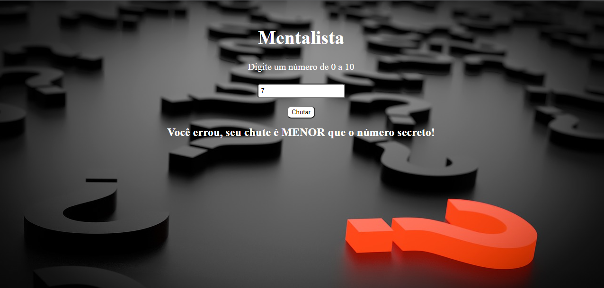

# Mentalista

O jogo consiste em advinhar um número secreto de 0 a 10 com 3 tentativas, que é gerado aleatoriamente e a cada chute do usuário o jogo informa se advinhou o número secreto, se o chute foi menor que o número secreto ou se foi maior que o número secreto, caso o usuário acerte o jogo gera um novo número secreto para ser advinhado novamente.

## Feito Com:

Copyright © DavidWillian

